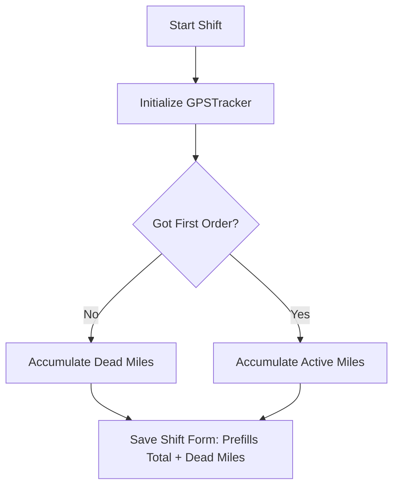

# COMMA GPS Tracking & Mileage Splits System

COMMA features a highly accurate, battery-efficient, and offline-resilient background GPS tracking system that automatically measures your driving distance and splits it into **Dead Miles** (commute/search) and **Active Miles** (deliveries).

---

## Architecture Overview

The mileage tracker is managed by the `GPSTracker` service in [`src/core/gps-tracker.js`](../src/core/gps-tracker.js). It runs as a persistent browser Geolocation watcher (`navigator.geolocation.watchPosition`) when a shift is active.



### Persistent Telemetry Storage

All metrics are stored in `localStorage` to survive accidental page reloads, browser background suspensions, or device restarts:

| Key | Type | Description |
| --- | --- | --- |
| `comma_active_gps_distance` | `string (Float)` | Total accumulated distance in kilometers. |
| `comma_active_gps_dead_distance` | `string (Float)` | Accumulated dead miles (commute/waiting) in kilometers. |
| `comma_active_gps_active_distance` | `string (Float)` | Accumulated active miles (delivering) in kilometers. |
| `comma_active_gps_first_order` | `string (Boolean)` | Flag indicating whether the "Got First Order" button was clicked. |
| `comma_active_gps_last_coord` | `JSON Object` | Latest coordinate cache `{ lat, lon, time }` used for computing the next Haversine delta. |

---

## Noise Reduction & Filtering Engine

Browser GPS telemetry is often noisy (location drift while parked, sudden cellular triangulation jumps). `GPSTracker` applies a strict three-tier sanitization filter to every incoming location coordinate:

1. **Accuracy Threshold Guard**: Discards any coordinates where `position.coords.accuracy > 25` meters.
2. **Stationary Jitter Filter**: Discards movements under $10\text{ meters}$ ($0.01\text{ km}$) to prevent distance accumulation while parked or waiting at restaurants.
3. **High-Speed Telemetry Anomaly Filter**: Discards physical speed jumps greater than $150\text{ km/h}$ to filter out sudden cellular location jumps.

---

## Dead Miles vs. Active Miles Partitioning

By default, gig drivers begin their shifts in **Dead Miles** mode (driving to hot-zones, waiting for orders).

1. **Before "Got First Order"**: Any distance traveled increments both `total` distance and `dead` distance.
2. **First Order Trigger**: The driver clicks "Got First Order" in the circular timer overlay. This marks the flag as `true` and swaps the UI theme from Amber/Waiting to Brand/Active.
3. **After "Got First Order"**: Any further distance traveled increments `total` distance and `active` distance.

### Pause-State Guard

To prevent battery drain and artificial mileage accumulation when drivers go on breaks, a guard checks `localStorage.getItem('comma_active_shift_timer')`. If the shift is **paused** or **stopped**, incoming coordinates are instantly discarded, and the last position cache is cleared.

---

## Developer Simulation Script

To test GPS accumulation in a local development environment where GPS position is static, run this command in your browser's Developer Console:

```javascript
(function simulateMovement() {
  let lat = 45.5017;
  let lon = -73.5673;
  
  console.log("🚀 GPS Simulation started! Simulating 50m movement every 3 seconds...");
  
  setInterval(() => {
    lat += 0.00045; // Move ~50 meters north
    lon += 0.00045; // Move ~50 meters east
    
    // Trigger navigator success handler directly
    const successKey = Object.keys(navigator.geolocation).find(k => k === '_success' || k.includes('success'));
    if (window.__gpsWatchHandler) {
      window.__gpsWatchHandler({
        coords: { latitude: lat, longitude: lon, accuracy: 5 },
        timestamp: Date.now()
      });
    } else {
      // Fallback: Dispatch custom event or let Geolocation watch trigger if mocked
      console.log(`Current simulated position: ${lat.toFixed(5)}, ${lon.toFixed(5)}`);
    }
  }, 3000);
})();
```
